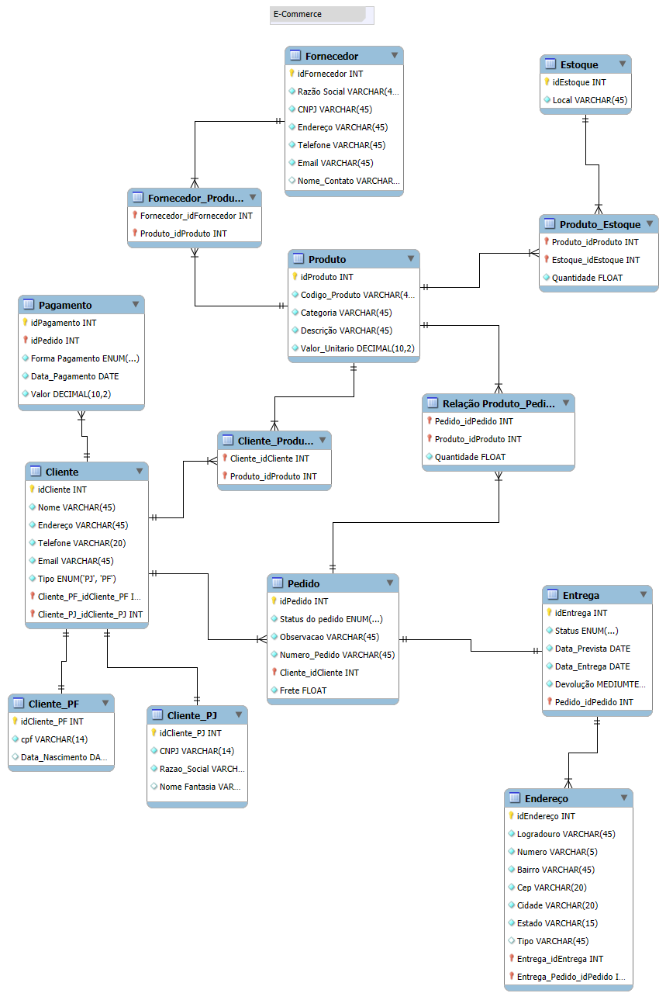

# Desafio de Projeto: Modelagem de um Banco de Dados para E-commerce
# DIO Randstad - Análise de Dados

Este repositório contém a solução para um Desafio de Projeto focado na modelagem e implementação de um banco de dados para um cenário de e-commerce. O objetivo foi aplicar conceitos de modelagem conceitual, lógica e física, culminando em um esquema SQL funcional, populado com dados de exemplo e consultado com queries de complexidade variada para extrair informações de negócio.

📄 Contexto do Desafio

O desafio consistiu em replicar e refinar uma modelagem de banco de dados para um e-commerce, implementando o script SQL para criação do esquema, persistindo dados para testes e, finalmente, elaborando queries para responder a perguntas de negócio.

Refinamentos Aplicados:
* Cliente: Distinção entre Cliente Pessoa Física (PF) e Pessoa Jurídica (PJ), garantindo que uma conta seja de um tipo ou de outro.
* Pagamento: Estrutura que permite ao cliente ter múltiplas formas de pagamento associadas à sua conta.
* Entrega: Inclusão de status de rastreio e código de rastreio para acompanhamento do pedido.

📊 Diagrama Entidade-Relacionamento (DER)

O esquema foi modelado para representar as principais entidades de um sistema de e-commerce, como clientes, produtos, pedidos e fornecedores, e seus respectivos relacionamentos.



🛠️ Tecnologias Utilizadas
* SQL:Linguagem padrão para a criação do esquema (DDL), inserção de dados (DML) e consultas (DQL).
* MySQL Workbench: Ferramenta utilizada para a modelagem do diagrama ER e execução dos scripts SQL.
* Git & GitHub: Para controle de versão e documentação do projeto.

📁 Estrutura do Repositório

O projeto está organizado nos seguintes arquivos:

* `ecommerce.mwb`: O arquivo do modelo do MySQL Workbench, contendo o diagrama ER.
* `ecommerce.png`: Imagem do Diagrama Entidade-Relacionamento.
* `ecommerce_db.sql`: Script DDL (Data Definition Language) contendo os comandos `CREATE TABLE` para gerar todo o esquema do banco de dados.
* `ecommerce_data.sql`: Script DML (Data Manipulation Language) com comandos `INSERT INTO` para popular o banco com dados de exemplo.
* `ecommerce_queries.sql` e `ecommerce_queries_2.sql`: Scripts DQL (Data Query Language) com uma série de consultas SQL para extrair informações e responder a perguntas de negócio.

Exemplos de Consultas SQL (Perguntas de Negócio)

Abaixo estão alguns exemplos das queries desenvolvidas para analisar os dados.

1. Quantos pedidos foram feitos por cada cliente?
```sql
SELECT
    c.nome AS nome_cliente,
    COUNT(p.id_pedido) AS total_de_pedidos
FROM
    cliente c
LEFT JOIN
    pedido p ON c.id_cliente = p.id_cliente
GROUP BY
    c.id_cliente, c.nome
ORDER BY
    total_de_pedidos DESC;
```

2. Qual o valor total de cada pedido e quais clientes fizeram pedidos acima de R$ 500,00?
```sql
SELECT
    c.nome AS nome_cliente,
    p.id_pedido,
    (SUM(rpp.quantidade * pr.valor_unitario) + p.frete) AS valor_total_pedido
FROM
    cliente c
JOIN pedido p ON c.id_cliente = p.id_cliente
JOIN relacao_produto_pedido rpp ON p.id_pedido = rpp.id_pedido
JOIN produto pr ON rpp.id_produto = pr.id_produto
GROUP BY
    c.nome, p.id_pedido, p.frete
HAVING
    valor_total_pedido > 500.00
ORDER BY
    valor_total_pedido DESC;
```

3. Listar produtos com baixo estoque (< 30 unidades) e o contato do fornecedor.
```sql
SELECT
    p.descricao AS produto_com_baixo_estoque,
    pe.quantidade,
    e.local AS local_estoque,
    f.razao_social AS fornecedor,
    f.telefone AS telefone_fornecedor
FROM
    produto p
JOIN produto_estoque pe ON p.id_produto = pe.id_produto
JOIN estoque e ON pe.id_estoque = e.id_estoque
JOIN fornecedor_produto fp ON p.id_produto = fp.id_produto
JOIN fornecedor f ON fp.id_fornecedor = f.id_fornecedor
WHERE
    pe.quantidade < 30;
```

🚀 Como Utilizar
1.  Clone este repositório: `git clone https://github.com/seu-usuario/desafio-db-ecommerce.git`
2.  Em um cliente MySQL de sua preferência (MySQL Workbench, DBeaver, etc.), conecte-se a um servidor.
3.  Execute o script `ecommerce_db.sql` para criar toda a estrutura de tabelas.
4.  Execute o script `ecommerce_data.sql` para popular o banco com dados de exemplo.
5.  Execute os scripts `ecommerce_queries.sql` e `ecommerce_queries_2.sql` para testar as consultas.


Autor:
Fernando Andrade
